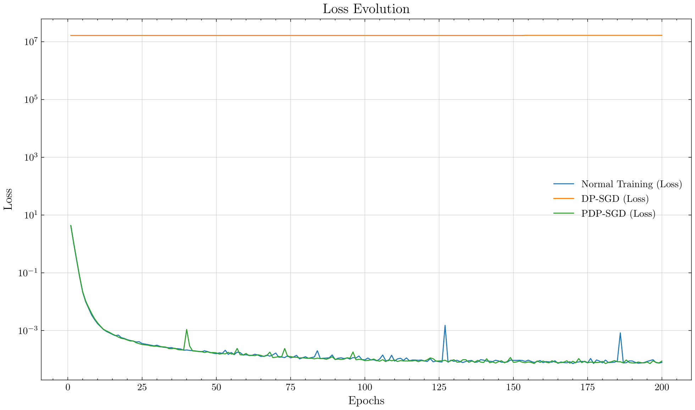

# Differential Privacy: Gradient Leakage Attacks in Federated Learning Environments

In this project, we explore the application of differential privacy techniques, such as DP-SGD or PDP-SGD (i.e., by explicit loss regularization), to mitigate privacy risks in Machine Learning models. We focus on the effectiveness of these techniques against gradient leakage attacks, where optimization methods can be used to reconstruct training instances based on the inner gradients of a model.

We implement a gradient leakage attack to evaluate the robustness of differentially private models. The attack is based on the work by [Zhu et al. (2019)](https://arxiv.org/abs/1906.08935), which demonstrates how to reconstruct training data from model gradients. Moreover, we compare this *traditional* approach with a more recent one that utilizes explicit regularization to achieve differential privacy. This method is based on the work by [Gonzalez et al. (2024)](https://arxiv.org/abs/2409.17144), which proposes a new approach to achieve differential privacy through loss function regularization.

We also compare the performance of different models, including a custom Convolutional Neural Network (CNN), a pretrained ResNet50, and a pretrained DINOv2 with registers (Vision Transformer), under various levels of differential privacy. The models are evaluated on their classification accuracy over a complex task, specifically the classification of hot-dog vs. not hot-dog images (see [dataset](https://www.kaggle.com/datasets/dansbecker/hot-dog-not-hot-dog/data)). Likewise, we evaluate the reconstruction of training instances from the gradients of a model with differential privacy applied on the standard MNIST dataset.

We utilize the [Opacus](https://opacus.ai/) library by META for implementing differential privacy in our models. The project includes a Jupyter Notebook for analysis and visualization of results, as well as scripts for training and evaluating the models.
## Project Structure

The repository is organized as follows:

- **`train.py`**: Main script for training the models.
- **`static/`**: Directory containing plots and figures generated during training and evaluation.
- **`analysis.py`**: Jupyter Notebook with code to generate figures and perform analysis for the paper.
- **`config.py`**: Configuration file for managing project settings.
- **`data/`**: Folder containing datasets used for training and evaluation.
- **`models.py`**: Implementation of the machine learning models used in the project.
- **`utils.py`**: Auxiliary utility functions to support various tasks.
- **`gradient_attack.py`**: Code implementation for the gradient leakage attack.

## Project Setup

1. Clone the repository
2. Unzip the dataset and place it in the `data` folder
```bash
unzip data.zip
```
3. Running the Code:

> [!NOTE]  
> The project has recently switched to using the `uv` package manager for automatically managing dependencies without the need for manually installing and updating them. Please make sure to have `uv` installed in your system. Otherwise, you can install it following the instructions in the [uv documentation](https://docs.astral.sh/uv/).

> [!IMPORTANT]
> When running the code for the first time, `uv` will automatically install all the required dependencies in a virtual environment. This process may take a few minutes, depending on your internet connection and system performance. You do not need to worry about syncing the lock file or the virtual environment, the package manager will handle everything for you.

In order to run the classification training, you can do so by running the `train.py` script:
```bash
uv run train.py
````
To run the gradient leakage attack, you can execute the `gradient_attack.py` script:
```bash
uv run gradient_attack.py
```
In both cases, you can specify the model and the dataset to be used by modifying the `config.py` file.

## Results

## Classification Benchmarks on Differentially Private Training

| Model | $\varepsilon$ | Accuracy | Precision | Recall/Sensitivity | Specificity | $F_1$ | MCC |
|--------|---------------|----------|-----------|---------------------|-------------|-------|-----|
| **Convolutional Neural Network (Custom-CNN)** ||||||||
| Traditional Training | $\infty$ | 0.584 | 0.586 | 0.572 | 0.596 | 0.579 | 0.168 |
| DP-SGD $(\varepsilon=8)$ | 8 | 0.532 | 0.750 | 0.096 | 0.968 | 0.170 | 0.131 |
| DP-SGD $(\varepsilon=25)$ | 25 | 0.598 | 0.612 | 0.536 | 0.660 | 0.571 | 0.198 |
| DP-SGD $(\varepsilon=50)$ | 50 | 0.588 | 0.655 | 0.372 | 0.804 | 0.475 | 0.195 |
| Explicit Regularization | -- | 0.614 | 0.609 | 0.636 | 0.592 | 0.622 | 0.228 |
| **Pretrained ResNet50 (*Fine-Tuning* Only the *Classification Head*)** ||||||||
| Traditional Training | $\infty$ | 0.886 | 0.873 | 0.904 | 0.868 | 0.888 | 0.773 |
| DP-SGD $(\varepsilon=8)$ | 8 | 0.844 | 0.831 | 0.864 | 0.824 | 0.847 | 0.689 |
| DP-SGD $(\varepsilon=25)$ | 25 | 0.868 | 0.871 | 0.864 | 0.872 | 0.868 | 0.736 |
| DP-SGD $(\varepsilon=50)$ | 50 | 0.866 | 0.877 | 0.852 | 0.880 | 0.864 | 0.732 |
| Explicit Regularization | -- | 0.892 | 0.883 | 0.904 | 0.880 | 0.893 | 0.784 |
| **Pretrained DINOv2-w/ Registers (Vision Transformer, *Fine-Tuning* Only the *Classification Head*)** ||||||||
| Traditional Training | $\infty$ | 0.972 | 0.992 | 0.952 | 0.992 | 0.971 | 0.945 |
| DP-SGD $(\varepsilon=8)$ | 8 | 0.964 | 0.992 | 0.936 | 0.992 | 0.963 | 0.929 |
| DP-SGD $(\varepsilon=25)$ | 25 | 0.968 | 0.996 | 0.940 | 0.996 | 0.967 | 0.938 |
| DP-SGD $(\varepsilon=50)$ | 50 | 0.968 | 0.996 | 0.940 | 0.996 | 0.967 | 0.938 |
| Explicit Regularization | -- | 0.968 | 0.996 | 0.940 | 0.996 | 0.967 | 0.938 |

## Gradient Leakage Reconstruction Attack

1. **Structural Similarity Index Measure (SSIM) over Reconstruction:**
    
    

2. **Reconstruction Loss Evolution:**  
    

3. **Example of Reconstruction Evolution (Normal Training):**  
    

## Good References

## Libraries and Tools
- [Opacus Library by META](https://opacus.ai/)
- [List of Available Models in `torchvision`](https://pytorch.org/vision/main/models.html#classification)

## Papers & Lecture Notes
- [Differential Privacy: DP-SGD (Gradient Clipping and Gaussian Noise Addition)](https://arxiv.org/pdf/1607.00133) (Original Paper by Goodfellow)
- [Opacus Paper](https://arxiv.org/pdf/2109.12298)
- [Paper on Gradient Leakage Attacks](https://arxiv.org/abs/2004.10397)
- [DP via Loss Function Regularization (Univ. Granada)](https://arxiv.org/abs/2409.17144)
- [Paper on Synthetic Data Generation](https://arxiv.org/pdf/2306.01684)
- [Good Notes on Possible Attacks to DP-SGD](https://www.khoury.northeastern.edu/home/alina/classes/Fall2021/Lecture17_Notes.pdf)
- [Another Good Reference on Gradient Leakage Attacks](https://link.springer.com/article/10.1007/s10462-023-10550-z)

## Datasets
- [Hot-Dog vs Not Hot-Dog Dataset](https://www.kaggle.com/datasets/dansbecker/hot-dog-not-hot-dog/data)
- [Toxicity Classification Dataset](https://www.kaggle.com/c/jigsaw-unintended-bias-in-toxicity-classification/data)